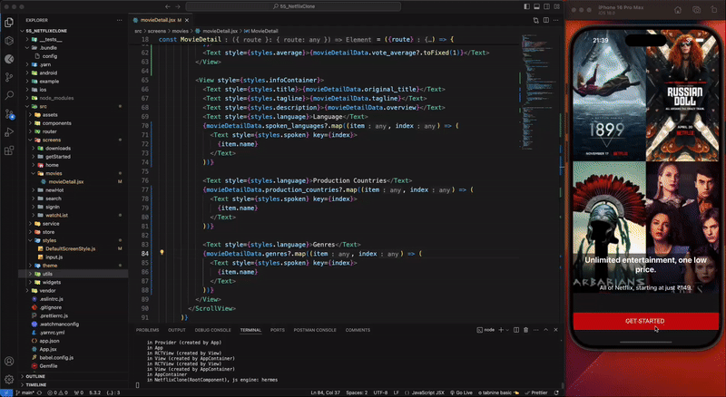

# Netflix Clone Uygulaması – React Native ile Modern Film Deneyimi 

Netflix Clone projem, React Native kullanılarak tasarlanmıştır. Proje trendleri keşfetme ve detaylı film bilgilerine ulaşma gibi deneyimleri yaşamasını sağlar.

📌 Özellikler:

Ana Ekran: Popüler filmler ve trendler bölümü.
Film Detay Ekranı: Seçilen film hakkında daha fazla bilgi ve görseller.
Responsive Tasarım: Farklı cihaz ve ekran boyutlarına uyumlu esnek tasarım.

📚 Kullanılan Teknolojiler ve Kütüphaneler:

React Native: Uygulamanın temel altyapısı.
@react-navigation/bottom-tabs
@react-navigation/native
@react-navigation/native-stack
@reduxjs/toolkit
react-redux

Formik ve Yup: Form yönetimi ve doğrulama.
Axios: API entegrasyonu.
Iconsax React Native: Estetik ikonlar.
React Native SVG: SVG görüntülerle zenginleştirilmiş arayüz.

🌟 TMDB API Entegrasyonu:
Uygulama, TMDB (The Movie Database) API'si kullanılarak gerçek zamanlı film verilerini alır ve kullanıcıların zengin bir içerik deneyimi yaşamasını sağlar.

Bu proje, film meraklıları için hem görsel hem de teknik anlamda üst düzey bir deneyim sunmak amacıyla tasarlanmıştır. React Native'in gücünü kullanarak geliştirdiğim bu uygulama, profesyonel bir kullanıcı deneyimi sunmayı hedefliyor.

Daha fazlasını öğrenmek ve projelerimi incelemek için benimle iletişime geçebilirsiniz! 

##  Designed by <a href="https://www.linkedin.com/feed/update/urn:li:activity:7272188749919186944/" target="_blank">Hüseyin ASLAN</a> 

### GİF

